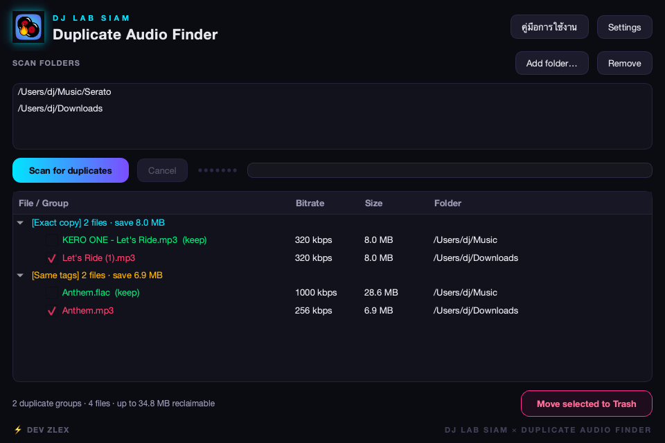

<div align="center">


# Duplicate Audio Finder

### ค้นหาและลบไฟล์เสียงที่ซ้ำกันอย่างปลอดภัย — บน macOS และ Windows

<em>แอปเดสก์ท็อปแท้ ไม่ต้องผ่านเบราว์เซอร์ ไม่ต้องพึ่งคลาวด์ ไฟล์ทุกอย่างอยู่บนเครื่องคุณ</em>

<br>

[English](README.md) · **ไทย 🇹🇭**

<br>

[](https://github.com/Thaitablist/duplicate-audio-finder/releases/latest)
[](https://github.com/Thaitablist/duplicate-audio-finder/actions)
[](#-ดาวน์โหลด)
[](#-ลิขสิทธิ์)

<br>

### ⬇️ ดาวน์โหลด

[](https://github.com/Thaitablist/duplicate-audio-finder/releases/latest/download/DuplicateAudioFinder-Setup.exe)
&nbsp;
[-000000?style=for-the-badge&logo=apple&logoColor=white)](https://github.com/Thaitablist/duplicate-audio-finder/releases/latest/download/DuplicateAudioFinder.dmg)

<br>



</div>

---

## ✨ ฟีเจอร์

- 🎯 **ตรวจแบบ Exact** — ไฟล์ที่เหมือนกันทุก byte ยืนยันด้วยการกรองขนาด + SHA-256 (เร็วและแม่นยำ 100%)
- 🏷️ **ตรวจแบบ Metadata** — tag เหมือนกัน (ศิลปิน / ชื่อเพลง / อัลบั้ม) แต่ไฟล์ต่างกัน (เช่นเพลงเดียวกันคนละ bitrate) แสดงแยกกลุ่มให้ตรวจก่อนลบ
- ☁️ **ปลอดภัยกับคลาวด์** — ข้ามไฟล์ placeholder แบบ "online-only" ของ OneDrive/คลาวด์ ไม่เข้าใจผิดว่าเป็นไฟล์ซ้ำ
- 🧠 **เลือกไฟล์เก็บอัตโนมัติ** — เลือกไฟล์ที่ควรเก็บ 1 ไฟล์ต่อกลุ่ม (bitrate สูงสุด → tag ครบสุด → ไม่ใช่ไฟล์ "copy" → เก่ากว่า)
- 🗑️ **ลบอย่างปลอดภัย** — ย้ายไป **Recycle Bin / Trash** (ไม่ลบถาวร) บันทึกทุกการลบ และปฏิเสธการลบไฟล์ทั้งกลุ่ม
- ⚡ **ไม่ค้าง** — สแกนทำงานเบื้องหลังพร้อม equalizer เคลื่อนไหว แสดง progress และยกเลิกได้
- 🎬 **สนุก** — มีคลิปเล่นฉลองเล็กๆ ตอนลบไฟล์เสร็จ

## ⬇️ ดาวน์โหลด

| แพลตฟอร์ม | ไฟล์ | ลิงก์ |
|---|---|---|
| 🪟 Windows | `DuplicateAudioFinder-Setup.exe` | [ดาวน์โหลด](https://github.com/Thaitablist/duplicate-audio-finder/releases/latest/download/DuplicateAudioFinder-Setup.exe) |
| 🍎 macOS | `DuplicateAudioFinder.dmg` | [ดาวน์โหลด](https://github.com/Thaitablist/duplicate-audio-finder/releases/latest/download/DuplicateAudioFinder.dmg) |

> **เปิดครั้งแรก:** แอปยังไม่ได้ code-sign ระบบจะเตือนครั้งเดียว
> - **Windows:** SmartScreen → *More info* → *Run anyway*
> - **macOS:** คลิกขวาที่แอป → *Open* (หรือรัน `xattr -dr com.apple.quarantine "/Applications/Duplicate Audio Finder.app"`)

## 🎧 วิธีตรวจจับไฟล์ซ้ำ

1. **จัดกลุ่มตามขนาด** — เฉพาะไฟล์ขนาดเท่ากันเท่านั้นที่มีสิทธิ์เหมือนกันทุก byte ช่วยลดงานส่วนใหญ่
2. **Hash** — SHA-256 (อ่านทีละ 64&nbsp;KB) ยืนยันว่าเป็นไฟล์ซ้ำ **แบบ exact**
3. **Tag** — ไฟล์ที่เหลือซึ่งมี *ศิลปิน + ชื่อเพลง + อัลบั้ม* ตรงกัน จัดเป็นกลุ่ม **metadata**

เทียบเฉพาะไฟล์ที่อ่านเป็นเสียงจริงได้ (มี bitrate/duration) ดังนั้นไฟล์ placeholder และไฟล์เสียจะไม่ทำให้เกิดไฟล์ซ้ำปลอม

## 🛡️ ความปลอดภัย

- ลบด้วยการ **ย้ายไป Trash/Recycle Bin** เท่านั้น — ไม่ลบถาวร กู้คืนได้
- แอป **ปฏิเสธ** การลบไฟล์ทั้งกลุ่ม (ต้องเหลืออย่างน้อย 1 ไฟล์เสมอ)
- ทุกการลบถูกบันทึกใน `delete_history.jsonl` ในโฟลเดอร์ข้อมูลของแอป

## 🛠️ Build เองจากซอร์ส

```bash
python -m venv .venv
source .venv/bin/activate          # Windows: .venv\Scripts\activate
pip install -e ".[dev]"
python -m dupaudio                  # รันแอป
pytest                             # รันเทสต์
```

### แพ็กเป็นแอป native

**macOS** → `.app` + `.dmg`
```bash
python build/make_icons.py
pyinstaller build/dupaudio.spec --distpath dist --workpath build/_work --noconfirm
bash build/make_dmg.sh
```

**Windows** → `.exe` + installer (ต้องมี [Inno Setup 6](https://jrsoftware.org/isdl.php))
```bat
build\build_windows.bat
```

> Release ถูก build อัตโนมัติด้วย GitHub Actions ทุกครั้งที่ push tag `v*` — ดู [`.github/workflows/build.yml`](.github/workflows/build.yml)

## 🧱 เทคโนโลยีที่ใช้

Python 3.11+ · [PySide6](https://doc.qt.io/qtforpython/) (Qt) · [mutagen](https://mutagen.readthedocs.io/) · [Send2Trash](https://github.com/arsenetar/send2trash) · แพ็กด้วย [PyInstaller](https://pyinstaller.org/)

แพ็กเกจ `src/dupaudio/core/` ไม่พึ่ง Qt ทำให้ตรรกะการตรวจจับ/ลบทั้งหมดทดสอบได้โดยไม่ต้องมีหน้าจอ

## 📝 ลิขสิทธิ์

MIT

---

<div align="center">
<sub>⚡ พัฒนาโดย <strong>Dev ZLEX</strong> · <strong>DJ LAB SIAM</strong> 🎧</sub>
</div>
